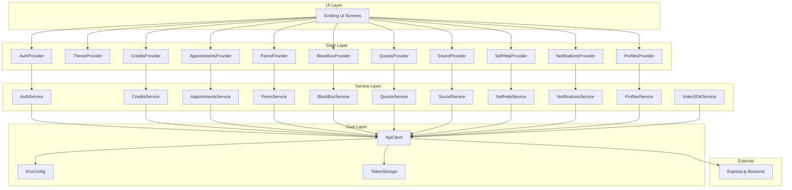
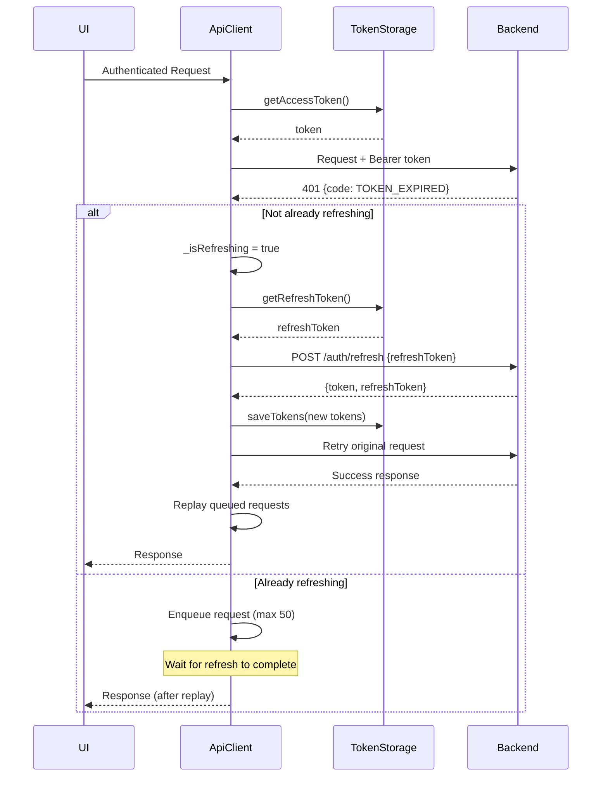
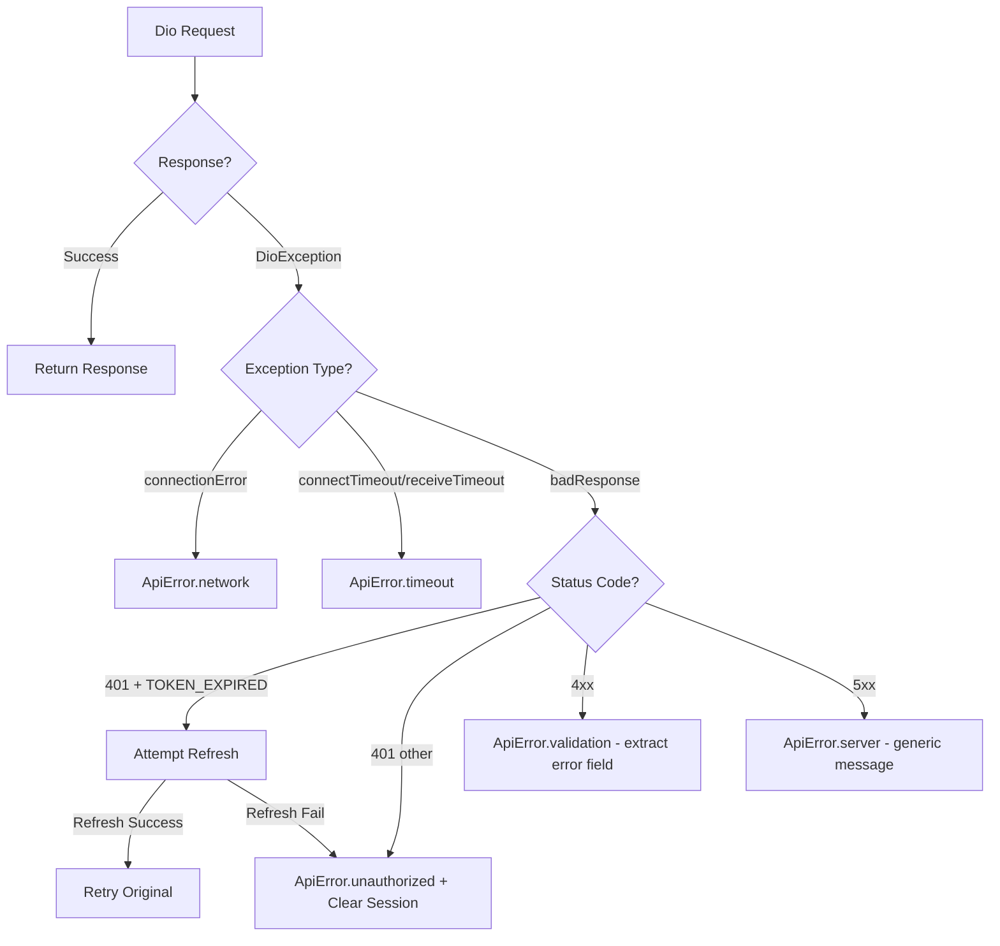

# Design Document: Flutter Backend Integration

## Overview

This design establishes the architecture for integrating the Eternia Flutter mobile app with the existing Express.js/Prisma/PostgreSQL backend. The integration mirrors the pattern already proven in the React website (Axios interceptors, auto-refresh on TOKEN_EXPIRED, localStorage for tokens) but adapted for Flutter's ecosystem using Dio, flutter_secure_storage, and Provider/ChangeNotifier.

The core challenge is replacing the current hardcoded IP (`192.168.0.110:5000`) and incomplete auth flow with a production-ready architecture that handles environment configuration, automatic token refresh with request queuing, secure token persistence, and a complete service layer for all 12 backend API modules.

**Key Design Decisions:**
- **Dio over http package**: Already in use; interceptors enable the same pattern as Axios for token attachment and refresh
- **flutter_secure_storage over SharedPreferences**: Tokens are sensitive credentials requiring encrypted storage (Keychain on iOS, EncryptedSharedPreferences on Android)
- **Provider/ChangeNotifier over Riverpod/Bloc**: Matches existing app pattern (AuthProvider, ThemeProvider already use this)
- **Service layer separate from Providers**: Services handle HTTP logic; Providers manage state and expose data to UI. This keeps concerns separated and testable.
- **--dart-define for environment config**: Compile-time configuration avoids runtime file loading and keeps secrets out of source

## Architecture



### Directory Structure

```
lib/
├── core/
│   ├── env_config.dart          # Environment configuration (--dart-define)
│   ├── api_client.dart          # Dio client with interceptors
│   ├── token_storage.dart       # flutter_secure_storage wrapper
│   └── api_error.dart           # Structured error types
├── services/
│   ├── auth_service.dart
│   ├── credits_service.dart
│   ├── appointments_service.dart
│   ├── peers_service.dart
│   ├── blackbox_service.dart
│   ├── quests_service.dart
│   ├── sound_service.dart
│   ├── selfhelp_service.dart
│   ├── notifications_service.dart
│   ├── profiles_service.dart
│   └── videosdk_service.dart
├── providers/
│   ├── auth_provider.dart       # (existing, refactored)
│   ├── theme_provider.dart      # (existing, unchanged)
│   ├── credits_provider.dart
│   ├── appointments_provider.dart
│   ├── peers_provider.dart
│   ├── blackbox_provider.dart
│   ├── quests_provider.dart
│   ├── sound_provider.dart
│   ├── selfhelp_provider.dart
│   ├── notifications_provider.dart
│   └── profiles_provider.dart
├── Screens/                     # (existing, unchanged)
└── main.dart                    # (updated: MultiProvider registration)
```

## Components and Interfaces

### EnvConfig (`lib/core/env_config.dart`)

Reads compile-time `--dart-define` values. Pure static class with no state.

```dart
class EnvConfig {
  static const String _defaultBaseUrl = 'https://eternia-ef-prisma.onrender.com/api';

  static String get baseUrl {
    const override = String.fromEnvironment('BASE_URL', defaultValue: '');
    if (override.isEmpty) return _defaultBaseUrl;
    if (_isValidUrl(override)) return override;
    // Log warning and fall back
    debugPrint('[EnvConfig] Invalid BASE_URL override: $override, using default');
    return _defaultBaseUrl;
  }

  static String get environment {
    return const String.fromEnvironment('ENV', defaultValue: 'production');
  }

  static bool _isValidUrl(String url) {
    final uri = Uri.tryParse(url);
    return uri != null &&
        (uri.scheme == 'http' || uri.scheme == 'https') &&
        uri.host.isNotEmpty;
  }
}
```

### TokenStorage (`lib/core/token_storage.dart`)

Wraps flutter_secure_storage for token CRUD operations.

```dart
class TokenStorage {
  static const _accessTokenKey = 'auth_token';
  static const _refreshTokenKey = 'refresh_token';
  final FlutterSecureStorage _storage;

  TokenStorage({FlutterSecureStorage? storage})
      : _storage = storage ?? const FlutterSecureStorage();

  Future<void> saveTokens({required String accessToken, required String refreshToken});
  Future<String?> getAccessToken();
  Future<String?> getRefreshToken();
  Future<void> clearTokens();
}
```

### ApiError (`lib/core/api_error.dart`)

Structured error types for programmatic error handling in the UI.

```dart
enum ApiErrorType {
  network,       // No internet / connection refused
  timeout,       // Connect or receive timeout exceeded
  server,        // 5xx responses
  validation,    // 4xx responses (error message from backend)
  unauthorized,  // 401 non-TOKEN_EXPIRED (session invalid)
  unknown,       // Unexpected errors
}

class ApiError {
  final ApiErrorType type;
  final String message;
  final int? statusCode;
  final String? backendCode;

  ApiError({required this.type, required this.message, this.statusCode, this.backendCode});
}
```

### ApiClient (`lib/core/api_client.dart`)

Central Dio instance with request/response interceptors. Handles:
1. Token attachment on every request
2. Auto-refresh on 401 + TOKEN_EXPIRED
3. Request queuing during refresh
4. Error classification into ApiError types

```dart
class ApiClient {
  final Dio _dio;
  final TokenStorage _tokenStorage;
  bool _isRefreshing = false;
  final List<_QueuedRequest> _requestQueue = []; // max 50

  ApiClient({required TokenStorage tokenStorage, Dio? dio})
      : _tokenStorage = tokenStorage,
        _dio = dio ?? Dio(BaseOptions(
          baseUrl: EnvConfig.baseUrl,
          connectTimeout: const Duration(seconds: 15),
          receiveTimeout: const Duration(seconds: 15),
        )) {
    _dio.interceptors.add(_buildInterceptor());
  }

  // Public API
  Future<Response> get(String path, {Map<String, dynamic>? queryParameters});
  Future<Response> post(String path, {dynamic data});
  Future<Response> patch(String path, {dynamic data});
  Future<Response> delete(String path);

  // Navigation callback for logout redirect
  VoidCallback? onSessionExpired;
}
```

**Interceptor Logic (mirrors React website's api.js):**



### Service Layer Pattern

Each service is a stateless class that takes an `ApiClient` and exposes typed methods:

```dart
class CreditsService {
  final ApiClient _api;
  CreditsService(this._api);

  Future<int> getBalance() async {
    final response = await _api.get('/credits/balance');
    return response.data['balance'] as int;
  }

  Future<Map<String, dynamic>> earn({required int amount, String? notes, String? referenceId}) async {
    final response = await _api.post('/credits/earn', data: {
      'amount': amount,
      if (notes != null) 'notes': notes,
      if (referenceId != null) 'reference_id': referenceId,
    });
    return response.data;
  }
  // ... spend, transactions, weeklyEarnTotal, createOrder, verifyPayment
}
```

### Provider Layer Pattern

Each provider follows a consistent pattern with loading state, error handling, and cache management:

```dart
class CreditsProvider extends ChangeNotifier {
  final CreditsService _service;
  
  bool _isLoading = false;
  String? _error;
  int? _balance;
  DateTime? _lastFetched;
  
  bool get isLoading => _isLoading;
  String? get error => _error;
  int? get balance => _balance;

  Future<void> fetchBalance({bool force = false}) async {
    if (!force && _lastFetched != null &&
        DateTime.now().difference(_lastFetched!) < const Duration(minutes: 5)) {
      return; // Use cached data
    }
    _error = null;
    _isLoading = true;
    notifyListeners();
    try {
      _balance = await _service.getBalance();
      _lastFetched = DateTime.now();
    } on ApiError catch (e) {
      _error = e.message;
      // Preserve cached _balance
    }
    _isLoading = false;
    notifyListeners();
  }
}
```

## Data Models

### Backend Response Shapes

Based on the backend source code, these are the key response structures:

**Login Response** (`POST /auth/login`):
```json
{
  "token": "jwt_access_token",
  "refreshToken": "jwt_refresh_token",
  "user": {
    "id": "uuid",
    "username": "string",
    "role": "student|expert|intern|admin",
    "institution_id": "uuid|null",
    "is_active": true,
    "is_verified": false,
    "avatar_url": "string|null",
    "specialty": "string|null",
    "bio": "string|null",
    "total_sessions": 0,
    "streak_days": 0,
    "training_status": "string|null",
    "training_progress": 0,
    "created_at": "ISO8601",
    "student_id": "string|null"
  },
  "creditBalance": 100
}
```

**Refresh Response** (`POST /auth/refresh`):
```json
{
  "token": "new_jwt_access_token",
  "refreshToken": "new_jwt_refresh_token"
}
```

**401 Token Expired Response**:
```json
{
  "error": "Token expired",
  "code": "TOKEN_EXPIRED"
}
```

**Credits Balance** (`GET /credits/balance`):
```json
{ "balance": 150 }
```

**Credits Earn** (`POST /credits/earn`):
```json
{
  "success": true,
  "earned": 5,
  "weekly_cap_reached": false,
  "new_balance": 155
}
```

**Notifications** (`GET /notifications`):
```json
{
  "notifications": [
    {
      "id": "uuid",
      "type": "peer_request|peer_accepted|peer_declined|peer_call|escalation",
      "title": "string",
      "message": "string",
      "is_read": false,
      "created_at": "ISO8601",
      "metadata": {}
    }
  ]
}
```

### Flutter Data Classes

No heavy model classes needed — the service layer works with `Map<String, dynamic>` for flexibility and to avoid maintaining parallel model definitions. The Providers expose typed getters for commonly accessed fields (e.g., `int? get balance`, `List<Map<String, dynamic>> get notifications`).

Exception: The `ApiError` class is a typed model since it's used for programmatic error handling across the entire app.

## Correctness Properties

*A property is a characteristic or behavior that should hold true across all valid executions of a system — essentially, a formal statement about what the system should do. Properties serve as the bridge between human-readable specifications and machine-verifiable correctness guarantees.*

### Property 1: URL Validation and Fallback

*For any* string provided as a BASE_URL override via `--dart-define`, if the string is a well-formed HTTP or HTTPS URL (has scheme, host, and path), the EnvConfig SHALL return that string as the base URL; otherwise, it SHALL return the production default URL `https://eternia-ef-prisma.onrender.com/api`.

**Validates: Requirements 1.3, 1.6**

### Property 2: Token Attachment to Requests

*For any* non-null access token string stored in TokenStorage, every authenticated request made through the ApiClient SHALL include an `Authorization` header with the value `Bearer <token>` where `<token>` is the exact stored string.

**Validates: Requirements 2.1**

### Property 3: Token Storage Round-Trip

*For any* pair of non-empty strings (accessToken, refreshToken), after calling `saveTokens(accessToken, refreshToken)` on TokenStorage, calling `getAccessToken()` SHALL return the same accessToken string and calling `getRefreshToken()` SHALL return the same refreshToken string.

**Validates: Requirements 3.1**

### Property 4: Request Queue Replay During Refresh

*For any* number N of authenticated requests (1 ≤ N ≤ 50) that arrive while a token refresh is in progress, when the refresh succeeds with a new access token, all N requests SHALL be replayed with the new token in their Authorization header, and none SHALL be lost or duplicated.

**Validates: Requirements 2.5**

### Property 5: Error Response Classification

*For any* HTTP error response from the backend:
- If status is 5xx, the ApiError SHALL have type `server` and the message SHALL NOT contain stack traces or internal exception details
- If status is 4xx (non-401), the ApiError SHALL have type `validation` and the message SHALL equal the `error` field from the response body
- If the error is a connection failure, the ApiError SHALL have type `network`
- If the error is a timeout, the ApiError SHALL have type `timeout`

**Validates: Requirements 2.7, 15.2, 15.3, 15.4, 15.6**

### Property 6: Profile PATCH Sends Only Changed Fields

*For any* subset of the updatable profile fields (avatar_url, specialty, bio, training_status, training_progress), when the user submits a profile update containing only those fields, the PATCH request body SHALL contain exactly those fields and no others.

**Validates: Requirements 5.2**

### Property 7: Client-Side Validation Prevents Submission

*For any* student ID verification request body that is missing one or more of the required fields (institution_id, id_type, raw_id), the ProfilesService SHALL return an error without making a network request.

**Validates: Requirements 5.4**

### Property 8: Sound Track Category Filtering

*For any* list of sound tracks and any category string, the client-side filter SHALL return exactly those tracks whose `category` field equals the requested category string (case-sensitive match), and SHALL return an empty list if no tracks match.

**Validates: Requirements 11.2**

### Property 9: Unread Notification Count

*For any* list of notification objects with varying `is_read` boolean values, the computed unread count SHALL equal the number of notifications where `is_read` is `false`.

**Validates: Requirements 13.5**

### Property 10: Notification Type Classification

*For any* notification object with a `type` field value in the set {peer_request, peer_accepted, peer_declined, peer_call, escalation}, the NotificationsService SHALL correctly identify and categorize the notification type without misclassification.

**Validates: Requirements 13.6**

### Property 11: Cache Staleness Triggers Fetch

*For any* Provider with a `_lastFetched` timestamp, if the elapsed time since `_lastFetched` exceeds 5 minutes, calling the fetch method SHALL trigger a new network request; if the elapsed time is 5 minutes or less, the Provider SHALL return cached data without a network request.

**Validates: Requirements 16.4**

## Error Handling

### Error Flow



### Error Handling Rules

1. **Never expose raw exceptions to UI** — All DioExceptions are caught in ApiClient and converted to ApiError
2. **Never expose internal server details** — 5xx errors get a generic "Server error, please try again" message
3. **Always preserve user data on error** — Providers keep cached data when a refresh fetch fails
4. **Always clear stale errors** — Providers set `_error = null` at the start of each operation
5. **Session expiry is global** — When tokens are cleared, `onSessionExpired` callback navigates to login regardless of which service triggered it

### Retry Strategy

- Token refresh: Attempted once per 401 TOKEN_EXPIRED. No exponential backoff.
- Failed requests during refresh: Rejected immediately (not retried independently)
- Network errors: Not automatically retried. UI can offer a "Retry" button that calls the Provider method again.

## Testing Strategy

### Unit Tests (Example-Based)

Unit tests cover specific scenarios and integration points:

- **EnvConfig**: Default URL when no override, valid override used, invalid override falls back
- **TokenStorage**: Save/read/clear operations, behavior when storage is empty
- **ApiClient interceptors**: Token attachment, refresh flow (success/failure), 401 without TOKEN_EXPIRED
- **Auth flow**: Login success/failure, register success/conflict, logout clears all data, session restore on launch
- **Provider lifecycle**: isLoading transitions, error property set/cleared, notifyListeners called
- **Service error mapping**: Each HTTP error code maps to correct ApiError type

### Property-Based Tests

Property-based testing is appropriate for this feature because several components have pure-function behavior with meaningful input variation (URL validation, filtering, error classification, token storage).

**Library**: `fast_check` (Dart property-based testing library)
**Configuration**: Minimum 100 iterations per property test

Each property test references its design document property:
- **Feature: flutter-backend-integration, Property 1**: URL validation and fallback
- **Feature: flutter-backend-integration, Property 2**: Token attachment
- **Feature: flutter-backend-integration, Property 3**: Token storage round-trip
- **Feature: flutter-backend-integration, Property 4**: Request queue replay
- **Feature: flutter-backend-integration, Property 5**: Error response classification
- **Feature: flutter-backend-integration, Property 6**: Profile PATCH changed fields only
- **Feature: flutter-backend-integration, Property 7**: Client-side validation prevents submission
- **Feature: flutter-backend-integration, Property 8**: Sound track category filtering
- **Feature: flutter-backend-integration, Property 9**: Unread notification count
- **Feature: flutter-backend-integration, Property 10**: Notification type classification
- **Feature: flutter-backend-integration, Property 11**: Cache staleness triggers fetch

### Integration Tests

Integration tests verify end-to-end flows with mocked HTTP responses:

- Full login → token storage → authenticated request → token refresh → retry flow
- App launch session restoration (token present vs absent vs expired)
- Each service endpoint called with correct method, path, and body structure
- Provider data fetch with cache hit vs cache miss

### What Is NOT Tested with PBT

- Individual service HTTP calls (thin wrappers, tested as integration)
- UI rendering and navigation (visual, not property-testable)
- Backend behavior (tested separately in backend test suite)
- flutter_secure_storage internals (third-party library)
